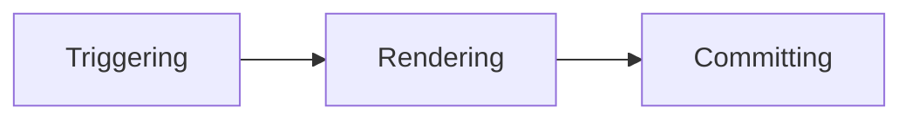
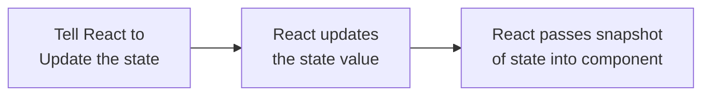

## Adding Interactivity

- For example, clicking an image gallery switches the active image
- Data changes over time is callled state
##### State: component's memory
- Components need to "remember " things: current input value, current image, shopping cart. This kind of component-specific memory is called state
#### Responding to events
- See, handling events is just passing function to eventhandlers which are predefined in respective framework
- How can you pass the function is important
	- we pass only function reference rather than result of function
	- ex: onClick={func} ✅, onClick={func()}❌, in the second scenario, we are passing result of the function
	- as we know, functions are variables in javascript we can pass the whole function in below scenarios
		- button onClick={function handleClick() {  alert('You clicked me!');}}
		- button onClick={() => {  alert('You clicked me!');  }
	- Just don't fall on this pitfall
		- button onClick={() => alert('...')}✅
		- button onClick={alert("something")}❌
- The most important usecase is passing event handler to children

```
// App sending event handlers to Toolbar via props

export default function App() {
  return (
    <Toolbar
      onPlayMovie={() => alert('Playing!')}
      onUploadImage={() => alert('Uploading!')}
    />
  );
}

// Toolbar calling event handlers without knowing what do they represent

function Toolbar({ onPlayMovie, onUploadImage }) {
  return (
    <div>
      <Button onClick={onPlayMovie}>
        Play Movie
      </Button>
      <Button onClick={onUploadImage}>
        Upload Image
      </Button>
    </div>
  );
}
```

- ##### Note
	- For example, to handle clicks, use [`<button onClick={handleClick}>`](https://developer.mozilla.org/en-US/docs/Web/HTML/Element/button) instead of `<div onClick={handleClick}>`. Using a real browser `<button>` enables built-in browser behaviors like keyboard navigation

#### Event propagation

- Events declared in children are propagated to the parent like in example
```
<div className="Toolbar" onClick={() => {
  alert('You clicked on the toolbar!');
}}>
  <button onClick={() => alert('Playing!')}>
	Play Movie
  </button>
  <button onClick={() => alert('Uploading!')}>
	Upload Image
  </button>
</div>
```

- In this scenario, if you click on button, even div will also calls the event handler as his child has been clicked
	- ##### Note
	- All events propagate in React except `onScroll`, which only works on the JSX tag you attach it to.
- If you want to stop the propagation, you know the event always travels like an object to eventhandler and it has a method called stopPropagation, you can call it, if you want to 
```
<button onClick={e => {
      e.stopPropagation();
      onClick();
}}>
```

- [`e.stopPropagation()`](https://developer.mozilla.org/docs/Web/API/Event/stopPropagation) stops the event handlers attached to the tags above from firing.
- [`e.preventDefault()`](https://developer.mozilla.org/docs/Web/API/Event/preventDefault) prevents the default browser behavior for the few events that have it.
- ##### Eventhandler are not pure, infact they are the best to change the value of something, but to change something, you need someway to store it, which is state

#### State: A component's memory

##### when a regular variable is not enough
- Local variable don't persist between renders, when a render happens, it renders from scratch
- Changes to local variables don't trigger renders
- for these two things to happen, we need to start a useState variable to do this, useState is the thing
	- Retain the data between renders
	- Trigger React to render component with new data
- Hooks are special functions that are only available while react is rendering
- Hooks should be called only at the top of your component, you can't call hooks in conditions, loops. You use React features at the top of your component, same like import modules
- Whenever we see this code: 

```
const [index,setindex] = useState(0)
```

- Your component renders the first time, it returns [0,setIndex]
- when you update the state, setIndex(0+1), it return [1,setIndex]
- When react seees again useState(0), it remembers the index value as 1
- You can have multiple state variables, if the state variables are not related.But if they are related like form variables, its more convenient to have a single state variable
##### State is isolated and private
- State is local to component instance on the screen, if you render same component twice, each copy is a separate instance
- State is private too, the parent component can not know the state of child component by any chance

#### Render and commit

- Most of us think that rendering is just displaying the rendering tree in browser, but it is not, rendering is pre-step for the display


##### Trigger a render
- Two reasons for a component to render
	1. component's initial render
	2. component's state has been updated
	- ***Initial render***
		- when ever app starts, we need to trigger a initial render
		- If we observe closely, we will call render method in the rootfile like root.render(Some component)
	- ***Once the*** component has been initially rendered, further renders are done by set function
##### Rendering
- In basic def, "Rendering" is React calling your components
- On initial render, react calls root component, on further renders React calls function component whose state update triggered the render
- We already know, that component rendering is a recursive process, it goes till there are any nested components present in the tree

##### Commit to DOM
- ***Initial render*** :- React uses ***appendChild() DOM API*** to put al DOM nodes it has created on screen
-  ***For re-renders***, React will see, what has changed from previous component to present and only change that
- When the total DOM has been updated, browser repaint the screen.(***painting***)

#### State as a snapshot
- We already know setting state requests re-render from React
- ***Rendering***: When React re-renders a component
	- React calls your function(component) again, which returns a JSX snapshot
	- React then updates the screen to match the snapshot returned from your function



```
<button onClick={() => {  
setNumber(number + 1);  
setNumber(number + 1);  
setNumber(number + 1);  
}}>+3</button>
```

- If you see in the above code, number will be 0 in all the setState functions, becoz they are in one snapshot, number is fixed, it doesn't change in first render and come back and be as 1 in the second setState function
##### State over time
```
<button onClick={() => {
        setNumber(number + 5);
        setTimeout(() => {
          alert(number);
        }, 3000);
      }}>+5</button>
```

- Similarly, in the above code,  a state variable's value never changes within a render, even if event handler's code is asynchronous.
- ##### Its value is fixed, when React took the snapshot of UI by calling your component
- So, event handlers created in the past have state values from the render in which they were created.
#### Queueing a Series of State Updates
##### React batches state updates
- React waits until all code in the event handlers has run before processing your state updates, so re-render happens after all set function calls
						- ![[i_react-batching.png]]
- Above figure is a resemblance of React rendering only after calling all set functions like a waiter taking all your orders
- UI won't be updated until after your event handler, and any code in it completes. This behaviour is **batching**
##### Updating same state multiple times before next render
- ***setNumber(n => n+1)*** will do something with the state value instead of just replacing it
- n => n+1 is called an updater function
- we have this code 
```
setNumber(n => n + 1);
setNumber(n => n + 1);
setNumber(n => n + 1);
```

	- According to batching, all the three functions are executed after the event handler function is over,
	- But the difference is , ikkada manam actual state number edho techukoni danni update chesthunnam, direct number + 1 ani anatledhu
	- number + 1 ante, aa render lo edhaithe number undho danne theeskuntam
	- (imp)where as the scenario, where we are not using any updater function, we are just replacing value with the variable not changing the state varible

```
<button onClick={() => {  setNumber(number + 5);  setNumber(n => n + 1);}}>
```
	- if you could able to say number in above code is 6, then you understood the concept, if not check how it 6 (https://react.dev/learn/queueing-a-series-of-state-updates)
	- FYI, we get the actual number from queue, updater function pushes the number to the queue
- ##### challenge 1(imp)
	- check out the challenge [here](https://react.dev/learn/queueing-a-series-of-state-updates)
	- In this challenge, you see delay 3 seconds will temporarily make react to take the variables from same state snapshot even if you cllick multiple times
	- But when we write updater functions, we see it gets added into queue and gets rendered only by taking the result from the previous value of queue no matter how many times you click the button
- ***challenge 2(imp)***
	- This challenge will explicitly say how the state will get updated in the case of updater functions
##### updating objects in a state
- When you want to update an object, you need to create one or make a copy and update it
	```
	const [position,setPosition] = useState({x: 0, y:0})
	position.x = 1
	position.y = 2
	The above variables x,y will not re-render the component, we need to change the object only by the function setPosition
	```
	- ##### You can replace the entire object like
		 ```
		 setPosition({
	          x: e.clientX,
	          y: e.clientY
	        });
		```
		- It is always advisable not to change the state objects like position.x = 1, position.y = 2
		- But we can change the local objects as the way we like if they are not state objects.
##### Copying objects with spread syntax
- You can use the spread syntax (...) to copy the whole object, but override a particular property
	```
	setPerson({  
	...person, // Copy the old fields  
	firstName: e.target.value // But override this one  
	});
	```
- '[]' is actually used for evaluating expressions, you can use this to keep firstName coming as a argument, where the code becomes
	```
	setPerson({
	      ...person,
	      [e.target.name]: e.target.value
	    });
	```
	- paina code lo, nuvvu e property change cheyyali anukuntunnavo adhi isthe chaalu, automatic ga adhe substitute cheskuntadhi
	- [] idhi endhuku iyyalante, [] expression evaluate cheyadaniki vadtham dhinni, so idhisthe automatic ga expression evaluate aipoi value vasthadhi
- spread syntax(...) does a shallow copy means, it just copies the outer object and the nested object is not copied instead points to original object rather than a copy
	```
	setPerson({  
	...person, // Copy other fields  
	artwork: { // but replace the artwork  
	...person.artwork, // with the same one  
	city: 'New Delhi' // but in New Delhi!  
	}  
	});
	```
##### Objects are really not nested
- All of the time, we thought nesting is a object asset, but its not , it is actually another object like 
	```
	obj1 = { x: 1, y: 2
	}
	obj2 = { z: 1, n: {x: 1, y: 2}}
	```
- In the above scenario, we are actually not creating another object in place of {x: 1,y: 2}, we are just pointing to obj1
- So, now you can understand why shallow copy is done by default
- **Note**: To update a nested object, you need to create a copies all the way up from the place y're updating
##### Usage of immer
- Immer is the library to use when you have deeply nested objects and you can't keep on recreating the top objects
- if a object is like this say: 
```
name: 'Niki de Saint Phalle',  
artwork: {  
title: 'Blue Nana',  
city: 'Hamburg',  
image: 'https://i.imgur.com/Sd1AgUOm.jpg',  
}
```
- Normal mutation is like this 
```
setPerson({  
...person, // Copy other fields  
artwork: { // but replace the artwork  
...person.artwork, // with the same one  
city: 'New Delhi' // but in New Delhi!  
}  
});
```
- But with immer library you can do like this 
```
setPerson(draft => {  
draft.artwork.city = 'Lagos';  
});
```
- draft is the object of immer that records what you wanted to do underhood
- It also creates the copy and update the details but not explicitly by giving us features like draft, it looks like a normal mutation
##### Challenges
- checkout [challenge2](https://react.dev/learn/updating-objects-in-state#challenges) , a worthy exercise 

#### Updating arrays in state
- Arrays are mutable in javascript, but they are immutable when stored as state objects
- Just like objects, you need to create a new one, and update it
| --- | avoid(mutates array) | prefer(returns new array) |
| ------ | --------- | ----------------| 
| adding | push, unshift | concat, [...arr] spread syntax | 
| removing | pop, shift,splice | filter,slice|
| replacing | splice, arr[i] = ... assignment | map | 
| sorting | reverse,sort | copy the array first | 
- Alternatively, use immer for left column methods, as it does the same as right ones
##### push into array and unshift
- push will mutate an array, so we shouldn't use it 
- instead creates a copy of an array and add element to it 
```
setArtists( // Replace the state  
[ // with a new array  
...artists, // that contains all the old items  
{ id: nextId++, name: name } // and one new item at the end  
]  
);

If you want to prepend the array, you can write item before copying

{ id: nextId++, name: name }
...artists
```

##### Remove from an array
- To remove , we don't use pop, we use filter why?
- becoz filter returns a new array by removing the desired element
```
 setArtists(
	artists.filter(a =>
	  a.id !== artist.id
)
);
```

##### Transforming an array and Replacing 
- If you want to change some or all items of array, you can use map() why?
- Becoz, map modifies the original array, and returns the modified array
```
shapes.map(shape => {
    if(shape.type === 'square')
      return shape
    else 
      return {
      ...shape,
      y: shape.y + 50
      }
    })
})
```
- Even to replace array items, we do use map function

##### Inserting into array
- When to insert an element neither at beginning nor at end, we use slice method 
```
const nextArtists = [
  // Items before the insertion point:
  ...artists.slice(0, insertAt),
  // New item:
  { id: nextId++, name: name },
  // Items after the insertion point:
  ...artists.slice(insertAt)
];
```

##### Making other changes
- When you want to use reverse, sort methods to an array, we can't use them directly as they mutate original array with out returning anything
- so, copy an array, use these methods, and mutate it
- We already know, nested arrays are problem, as nested things are not copied, just point to original thing, so 
- we copy upto the wanted nested thing, modify it, simple!!!

##### Updating objects inside arrays
- An excerpt from doc
	`Objects are not _really_ located “inside” arrays. They might appear to be “inside” in code, but each object in an array is a separate value, to which the array “points”. This is why you need to be careful when changing nested fields like *list[0]*`
- When updating nested state, you need to create copies from point where you want to update, all the way up to top level
- If you just update the nested object like the way you do normal objects, it modifies original object and disturbs all its descendent instances
- So, the only solution is to copy upto that point and modify it.
```
setMyList(myList.map(artwork) => {
  if(artwork.id === artworkId){
    return { ...artwork, seen: nextSeen };
  }
  return artwork;
})
```
- In the above object, you are copying the nested object and modifying it 

##### Welcome immer
- Copying upto nested object is really a tiring thing, so it is better to use `immer`
- The above code can be refractored as: 
```
updateMyList(draft => {
  const artwork = draft.find(a => a.id === id);
  artwork.seen = nextSeen;
})
```
- Simple thing right, no copy , no problem.
- But remember, even at the ground level, immer does samething what we have been doing all these days
- You can even apply push/pop on draft object as you are modifying draft object.
- Think draft like a complete copy, not a shallow copy
##### challenges
- In [challenge2](https://react.dev/learn/updating-arrays-in-state#challenges), you can only use setProducts once in the function, obviously second function is not going to get the fruits of first thing right.


