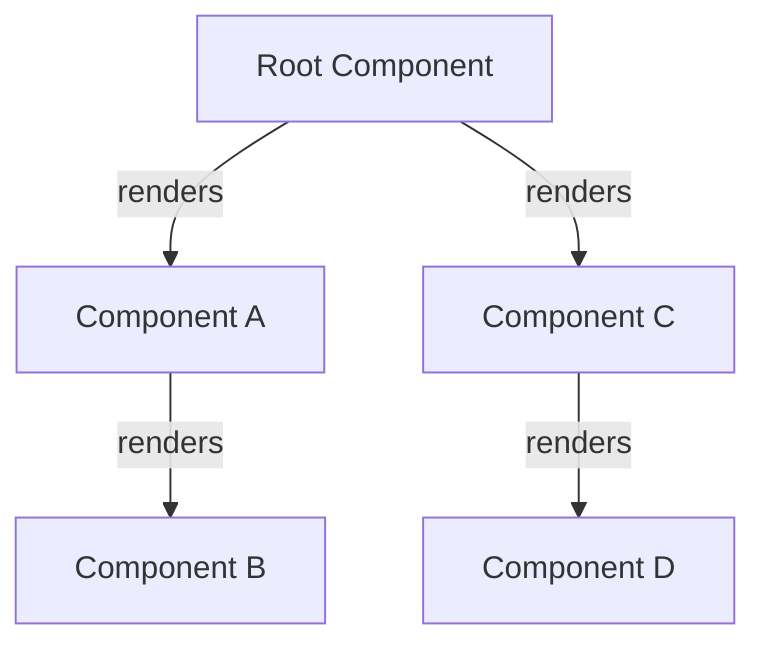
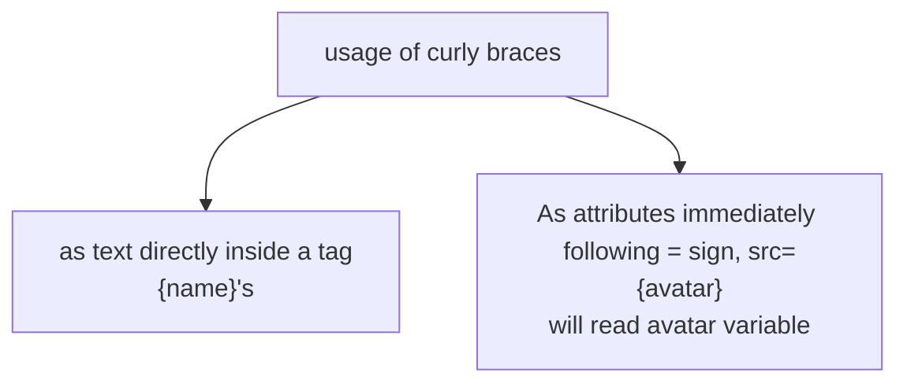

## Describing UI
-some javascript functions are pure, a pure function is : 
1. ##### Minds its own business: It does not change any objects or variables that existed before its is called
2. ##### Same inputs, same output: given the same inputs, it always give same output
3. Here is the example : [[impure_component]]
4. You can make the above component as pure by passing guest variable as props

## UI Tree

-React uses trees to model relationships between components and modules

 
 - Remember here you should include a note that says about export default
 - HTML tag always start with lowercase letters,  components always start with Uppercase letters
 - Components are regular javascript functions, you can keep multiple components in same file, if file gets crowded you move your component to nother file
 - Components can render other components, you must never nest their definitions
 
	```
	export default function Gallery() {  // 🔴 Never define a component inside another component!  function Profile() {    // ...  }  // ...}
	```

- Instead, define every component at top level

```
export default function Gallery() {  // ...}// ✅ Declare components at the top levelfunction Profile() {  // ...}
```

## Importing and Exporting Components

You may encounter an import like this : 
```
import Gallery from './Gallery';
```
- Either './Gallery.js' or './Gallery' will work with React, though former seems informative, latter also works
- ###### A file can have only one default export, but it can have numerous named exports

#### Q. Why do multiple JSX tags need to be wrapped?
```
A. JSX looks like HTML, but under the hood, it is transformed into plain JavaScript objects, You can't return two objects from a function without wrapping them in an array, so it is
```

- Camelcase most of the things, JSX as javascript has limitations on variable names , their names can't contain dashes or reserved words like class
- JSX allow you to write javascript inside curly braces



- When ever there are double curlies, it is actually a javascript object inside jsx, ex: 
```
<ul style={  
{  
backgroundColor: 'black',  
color: 'pink'  
} 
}>

Inline `style` properties are written in camelCase. 
```

## Props
1. ### Passing props to the component
	- you need to pass props to another component as 
		
	```
	<Avatar person="variable"
	name="praveen" />
    ```
	
	 - we are using person=, name= in the component, that is actually  the way of passing variables to the component
	- You can destructure the prop variables which are passed 
		
```
function Avatar({ person, size }) {  
// person and size are available here  
}
```

		-if you pass object to prop, you have to give double slashes as the object to be in one {} and general javascript in {}
		
```
<Avatar 
person={{
name: "Lin"
}} />
```

		- Props are the only argument for a component
		 - Here is the other statement, when you wanted to pass all the arguments you have to use, you can send like 
	
```
function Profile(props) {  
return (  
<div className="card">  
<Avatar {...props} />  
</div> 
);  
}

Here is the thing, props spread each operator as 
name = {name} value = {value} where name,value as the arguments
```

	### Passing JSX as children

```
<Card>
 <Avatar />
</Card>
```

		- Card is a component, which involves Avatar init, so Card takes Avatar as its prop and their we call this avatar in the Card component, here is the way we do it

```
 return (
    <div className="card">
      {children}
    </div>
  );
```


## Conditional rendering

You know everything about conditional rendering, like we use if else loops to place a content or not, mostly we use && for the conditional rendering: 

```
return (  
<li className="item">  
{name} {isPacked && '✔'}  
</li>  
);
```

#### Note
Javascript converts the left side to a boolean automatically, if left side is 0, whole expression gets value 0. So please make sure the left isde is absolute boolean value
```
Rather than this: 
messageCount && <p>New messages</p>
Do this: 
messageCount > 0 && <p>New messages</p>
```

In most of the times, we even do this : 
```
let itemContent = name;
  if (isPacked) {
    itemContent = name + " ✔";
  }
  return (
    <li className="item">
      {itemContent}
    </li>
  );
}
```

assigning value to variable with an if condition, itemContent will be changed based on a condition.
#### very imp note
```
1. At the most you need to understand, the && returns the last expression which is not null.
2. You cannot write javascript statements inside jsx, you can just write javascript expressions 
```

## Rendering lists
its useful when you wanted to display items of instances of same class, we do it by keeping all of them in an array, like
```
const listItems = chemists.map(person => <li>..</li>);
return (
<li>{listItems}</li>
)
Assume we are in a component
```

But keep this in mind: 
 
Arrow functions implicitly return the expression right after `=>`, so you didn’t need a `return` statement:

`   const listItems = chemists.map(person =>      <li>...</li> // Implicit return!    );   `

However, **you must write `return` explicitly if your `=>` is followed by a `{` curly brace!**

`   const listItems = chemists.map(person => { // Curly brace      return <li>...</li>;    });   `

- Always use a key for a rendering list items, as when we reorder, delete some items, it is important that rendering is optimal
- Mostly, key is id in the database elements or key is the name in list elements

## Pure components

- Already, by now, you might have known what the pure components are, 
  React assumes that every component you write is a pure function
- No confusion, simple english "If a component return same JSX with same input then it is a pure component"
- You should not mutate any of the inputs that your components use for rendering. That includes props, state, and context. To update the screen, [“set” state](https://react.dev/learn/state-a-components-memory) instead of mutating preexisting objects.
- ##### Strict mode in react checks whether a component is pure or not by calling them twice, if component return different result, it is impure and I think it returns error
- Similarly, it is important that the order of calling components doesn't matter
#### benefits of rendering
- components could run if diff env, as it serve many user requests
- we can skip rendering, as it return same results and they are safe to cache
- If some data changes in middle of rendering tree, React can start rendering without wasting time to finish the outdated render.Purity does not give any error when the whole rendering process is reinitiated again with the other data
#### inference from challenges
- We should not mutate actual DOM in the rendering phase , check this example to understand [more](https://react.dev/learn/keeping-components-pure#challenges)
- Two things wrong here, mutating actual DOM, mutating in rendering phase
- Always keep the mutations local, don't make mutations the public variables(props,state). check [this](https://react.dev/learn/keeping-components-pure#challenges)
	- The above statement also emphasize, working with duplicate array rather than the original one
## UI as a tree

![[react.dev/_next/imageurl=%2Fimages%2Fdocs%2Fdiagrams%2Fpreserving_state_dom_tree.dark.png&w=1080&q=75]]

![[preserving_state_dom_tree.webp]]
 
- React also uses tree structures to manage and model relationship between components, useful for data flow 
#### render tree
- Modeling a component relationship in a tree is a render tree
- Render tree is only composed of React components
- As it is platform agnostic, it may contain different elements based on UI not just html elements
#### module dependency tree/dependency tree
- Each node in module dependency tree is a module
- Each branch represents an import statement in that module
- Unlike render tree, module dependency tree contains modules not components
- Each node in a module dependency tree is a module, each branch represents an import statement in that module
- Dependency trees are useful to determine what modules are necessary to run your React app
- Bundlers will use dependency tree to determine what modules should be included
- With conditional rendering, render tree may change across different renders.

[Next section](React/adding_interactivity)


	
		


	
 

## React Component Life Cycle
- There are actally three common life cycles in react , look at the following figure to understand it better
- ![[ogimage.png]]
- The methods in green boxes are the life cycle methods, and they are executed as their name says
	- ***ComponentDidMount***: When the whole component is updated to DOM, this method will be executed
	- ***ComponentDidUpdate:*** When there is any change in props or state, this is the method which is executed
	- ***ComponentWillUnmount***: When component is withdrawn from DOM, this method will be executed
- There are much methods, which are less important, here we go
- ![[PVPr1dK.jpg]]
- getDerivedStateFromProps will give the props,state of present component
- shouldComponentUpdate will be executed for before render 
- getSnapShotBeforeUpdate gives the nextprops and nextState for the next update
- [Here](https://codesandbox.io/s/heuristic-maria-jhp477?file=/src/Lifecycle.jsx) is the link for the actual implementation of all those methods, gives you good idea on what was happening
- idhi rasetappudu nak konchem fever undhi anduke ekkuva explore cheyaledhu, the areas to explore are 
	- why static behind getDerivedStateFromProps
	- which function returns what to which function like shouldComponentUpdate has to return something to getSnapshotBeforeUpdate I guess.
## Composition vs Inheritance
- Inheritance is something we have to inherit from the above classes, like Dog inherits from Animal
- This all looks good but when we want to have a complex functionality, there will be duplication of code , for example
```
GameObject 
	. bark()

		Robot

			- drive()  
			    CleaningRobot
		- clean()
		
		MurderRobot
		
		• kill()
		
		MurderRobotDog
		
		-bark()
		
Animal
	
	- poop ()  
		Dog
	
	- bark()
	
	Cat
		meow()
```
- So, if a robot wants to bark and as it cannot poop, we need to create new methods for it and work it out.
- Rather than all this extra work out, if we create methods like poop, bark,meow,drive separately, we can just include them whenever we want to.
- Like create a object, add properties which are needed by the object